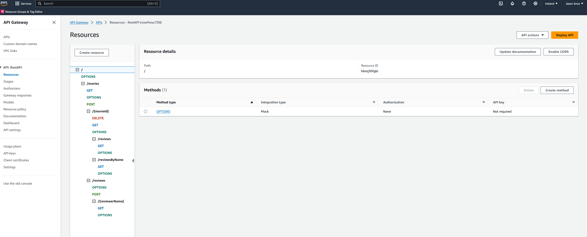
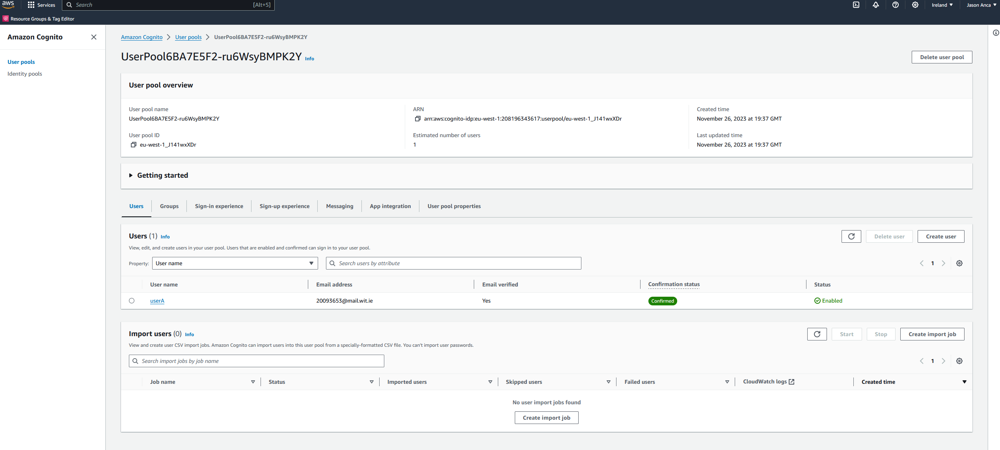

# ServerlessREST Assignment - Distributed Systems.
**Name**: Jason Anca

This repository contains the implementation of a serverless REST API for the AWS platform. A CDK stack creates the infrastructure. The domain context of the API is movie reviews.

# API Endpoints

- POST /movies/reviews - add a movie review.
- GET /movies/{movieId}/reviews - Get all the reviews for a movie with the specified id.
- GET /movies/{movieId}/reviews/{reviewerName}
- GET /movies/reviews/{reviewerName} - Get all the reviews written by a specific reviewer. - **Attempted with Error Output - AccessDeniedException**
- GET /movies/{movieId}/reviews?minRating=n - Get all the reviews for the movie with the specified ID with a rating greater than the minRating. **Attempted with empty output**

# Authentication
